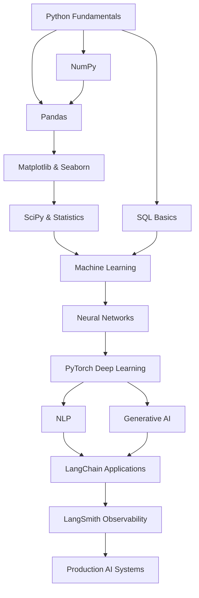

# 🚀 Data Science & AI Learning Hub

> *A comprehensive collection of structured learning paths for mastering data science, machine learning, and artificial intelligence*

---

## 📋 Table of Contents

- [🎯 Overview](#-overview)
- [📚 Learning Paths](#-learning-paths)
- [🗺️ Curriculum Structure](#️-curriculum-structure)
- [💻 Prerequisites](#-prerequisites)
- [🛠️ Tools & Technologies](#️-tools--technologies)
- [📖 How to Use This Repository](#-how-to-use-this-repository)
- [🏆 Learning Objectives](#-learning-objectives)
- [📅 Recommended Study Timeline](#-recommended-study-timeline)
- [🤝 Contributing](#-contributing)
- [📞 Support & Community](#-support--community)

---

## 🎯 Overview

Welcome to your comprehensive data science and AI learning journey! This repository contains 14 carefully crafted syllabi covering the essential skills needed to become a proficient data scientist and AI practitioner. From foundational Python programming and core scientific libraries (NumPy, Pandas, Matplotlib, Seaborn, SciPy) to advanced machine learning, deep learning, NLP, generative AI, PyTorch development, and LLM application frameworks (LangChain, LangSmith) - each syllabus is designed to take you from fundamentals to advanced applications with hands-on projects and real-world examples.

### Why This Learning Hub?

- **📋 Structured Learning**: Comprehensive syllabi with clear progression paths
- **🎯 Practical Focus**: Emphasis on hands-on implementation and real-world projects
- **🔗 Interconnected Topics**: Seamless transitions between related concepts
- **📈 Progressive Difficulty**: Builds complexity gradually with solid foundations
- **🏭 Industry-Relevant**: Covers current tools, techniques, and best practices

---

## 📚 Learning Paths

### 🐍 [01. Python for Data Science](./syllabus/01_python-syllabus.md)
**Level**: Beginner to Advanced

Master Python programming specifically for data science applications, covering everything from basic syntax to advanced libraries and deployment strategies.

**Key Topics**:
- Python fundamentals and data structures
- NumPy, Pandas, and data manipulation
- Data visualization with Matplotlib and Seaborn
- Statistical analysis and hypothesis testing
- Web scraping and API integration
- Production deployment and best practices

---

### 🗄️ [02. SQL for Data Science](./syllabus/02_sql-syllabus.md)
**Level**: Beginner to Advanced

Comprehensive SQL training from basic queries to advanced analytics, with focus on data science applications and modern database technologies.

**Key Topics**:
- Relational database fundamentals
- Advanced querying and joins
- Window functions and analytics
- Performance optimization and indexing
- NoSQL and modern data warehouses
- Integration with data science workflows

---

### 🤖 [03. Machine Learning](./syllabus/03_ml-syllabus.md)
**Level**: Intermediate to Advanced

Complete machine learning curriculum covering supervised, unsupervised, and reinforcement learning with practical implementation and deployment.

**Key Topics**:
- Supervised learning algorithms
- Unsupervised learning and clustering
- Feature engineering and selection
- Model evaluation and optimization
- Ensemble methods and advanced techniques
- MLOps and production deployment

---

### 🧠 [04. Neural Networks & Deep Learning](./syllabus/04_neural-networks-syllabus.md)
**Level**: Advanced

Deep dive into neural networks from basic perceptrons to state-of-the-art architectures like Transformers and modern generative models.

**Key Topics**:
- Neural network fundamentals
- Convolutional Neural Networks (CNNs)
- Recurrent Neural Networks (RNNs)
- Transformer architectures
- Computer vision applications
- Advanced optimization and training techniques

---

### 💬 [05. Natural Language Processing](./syllabus/05_nlp-syllabus.md)
**Level**: Advanced

Comprehensive NLP curriculum from text processing basics to modern transformer models and practical applications.

**Key Topics**:
- Text preprocessing and feature engineering
- Traditional NLP techniques
- Word embeddings and semantic representation
- Transformer models (BERT, GPT)
- NLP applications and tasks
- Modern research trends and techniques

---

### 🎨 [06. Generative AI](./syllabus/06_generative-ai-syllabus.md)
**Level**: Advanced

Cutting-edge generative AI covering GANs, diffusion models, large language models, and practical applications with ethical considerations.

**Key Topics**:
- Generative Adversarial Networks (GANs)
- Variational Autoencoders (VAEs)
- Diffusion models and text-to-image generation
- Large Language Models (LLMs)
- Multimodal generative models
- Ethics and responsible AI development

---

## 🔧 Core Libraries & Tools

### 🔢 [07. NumPy](./syllabus/07_numpy-syllabus.md)
**Level**: Beginner to Intermediate

Master NumPy, the foundational library for numerical computing in Python, essential for efficient array operations and mathematical computations.

**Key Topics**:
- NumPy arrays and data types
- Vectorized operations and broadcasting
- Array indexing, slicing, and manipulation
- Mathematical and statistical functions
- Linear algebra operations
- Performance optimization techniques

---

### 📊 [08. Pandas](./syllabus/08_pandas-syllabus.md)
**Level**: Beginner to Intermediate

Complete guide to Pandas for data manipulation, cleaning, and analysis with Series and DataFrame structures.

**Key Topics**:
- Series and DataFrame fundamentals
- Data loading from various formats
- Data cleaning and preprocessing
- Advanced data manipulation and transformation
- Time series analysis
- Integration with visualization libraries

---

### 📈 [09. Matplotlib](./syllabus/09_matplotlib-syllabus.md)
**Level**: Beginner to Intermediate

Comprehensive Matplotlib training for creating publication-quality visualizations and data plots in Python.

**Key Topics**:
- Plotting fundamentals and figure anatomy
- Line plots, scatter plots, and bar charts
- Advanced plot types and customization
- Subplots and multi-panel figures
- Styling and aesthetics
- Interactive visualizations

---

### 🎨 [10. Seaborn](./syllabus/10_seaborn-syllabus.md)
**Level**: Intermediate

Statistical data visualization with Seaborn, building on Matplotlib for elegant and informative graphics.

**Key Topics**:
- Statistical plotting fundamentals
- Distribution and categorical visualizations
- Regression and relationship plots
- Multi-plot grids and faceting
- Advanced customization and styling
- Integration with Pandas DataFrames

---

### 🧮 [11. SciPy](./syllabus/11_scipy-syllabus.md)
**Level**: Intermediate to Advanced

Scientific computing with SciPy covering advanced mathematical algorithms, optimization, and statistical methods.

**Key Topics**:
- Linear algebra and matrix operations
- Optimization and root finding
- Integration and differential equations
- Statistical functions and distributions
- Signal processing fundamentals
- Interpolation and spatial algorithms

---

## 🔥 Deep Learning & LLM Frameworks

### 🔥 [12. PyTorch](./syllabus/12_pytorch-syllabus.md)
**Level**: Intermediate to Advanced

Master PyTorch, the leading deep learning framework, from tensor operations to production deployment of neural networks.

**Key Topics**:
- Tensors and automatic differentiation (autograd)
- Neural networks with torch.nn
- CNN, RNN, and Transformer architectures
- Generative models (VAE, GAN, diffusion)
- Model optimization and quantization
- Production deployment and TorchServe

---

### 🦜 [13. LangChain](./syllabus/13_langchain-syllabus.md)
**Level**: Intermediate to Advanced

Build production-ready LLM applications with LangChain, covering RAG systems, agents, and conversational AI.

**Key Topics**:
- LLM integration and prompt engineering
- Chains and LangChain Expression Language (LCEL)
- Memory and context management
- Retrieval-Augmented Generation (RAG)
- Autonomous agents and tool usage
- Production deployment with LangServe

---

### 🔬 [14. LangSmith](./syllabus/14_langsmith-syllabus.md)
**Level**: Intermediate to Advanced

Master LLM observability with LangSmith for debugging, evaluation, and monitoring of AI applications.

**Key Topics**:
- Tracing and debugging LLM applications
- Dataset creation and management
- Evaluation metrics and experiments
- Production monitoring and analytics
- Feedback loops and continuous improvement
- MLOps workflows for LLM applications

---

## 🗺️ Curriculum Structure

### 📈 Learning Progression



### 🎯 Skill Levels

- **🟢 Beginner**: No prior experience required
- **🟡 Intermediate**: Basic programming and math knowledge
- **🔴 Advanced**: Strong foundation in ML/DL concepts

### 📚 Module Organization

Each syllabus follows a consistent structure:

1. **📖 Fundamentals** - Core concepts and theory
2. **🛠️ Implementation** - Hands-on coding and tools
3. **🚀 Advanced Topics** - Cutting-edge techniques
4. **🏗️ Projects** - Real-world applications
5. **📈 Assessment** - Evaluation and next steps

---

## 💻 Prerequisites

### 🔧 Technical Requirements

- **Computer**: Modern laptop/desktop with 8GB+ RAM
- **Operating System**: Windows, macOS, or Linux
- **Internet**: Stable broadband connection
- **Storage**: 50GB+ free space for datasets and projects

### 📚 Knowledge Prerequisites

| Topic | Prerequisites |
|-------|---------------|
| **Python** | Basic computer literacy |
| **SQL** | Basic computer literacy |
| **Machine Learning** | Python programming, basic statistics |
| **Neural Networks** | Python, ML basics, linear algebra |
| **NLP** | Python, ML basics, some linguistics helpful |
| **Generative AI** | Deep learning fundamentals, advanced math |

### 🧮 Mathematical Background

- **Linear Algebra**: Vectors, matrices, eigenvalues
- **Calculus**: Derivatives, gradients, chain rule
- **Statistics**: Probability, distributions, hypothesis testing
- **Discrete Math**: Set theory, logic, combinatorics

---

## 🛠️ Tools & Technologies

### 🐍 Programming Languages
- **Python** (Primary): Data science ecosystem
- **SQL**: Database querying and analytics
- **R**: Statistical computing (supplementary)
- **JavaScript**: Web applications and visualization

### 📊 Data Science Libraries

#### Core Python Stack (with dedicated syllabi)
```python
# Numerical Computing (Syllabus 07)
import numpy as np

# Data Manipulation (Syllabus 08)
import pandas as pd

# Visualization (Syllabi 09 & 10)
import matplotlib.pyplot as plt
import seaborn as sns

# Scientific Computing (Syllabus 11)
import scipy

# Machine Learning
from sklearn import *
import xgboost as xgb
import lightgbm as lgb

# Deep Learning
import torch
import tensorflow as tf
from transformers import *
```

#### Specialized Libraries
- **Statistics**: SciPy (see Syllabus 11), Statsmodels
- **Visualization**: Plotly, Bokeh, Altair
- **NLP**: NLTK, spaCy, Hugging Face (see Syllabus 05)
- **Computer Vision**: OpenCV, PIL, Albumentations
- **Big Data**: Dask, PySpark, Ray

### 🗄️ Databases & Data Storage
- **Relational**: PostgreSQL, MySQL, SQLite
- **NoSQL**: MongoDB, Redis
- **Data Warehouses**: BigQuery, Snowflake, Redshift
- **File Formats**: CSV, JSON, Parquet, HDF5

### ☁️ Cloud Platforms
- **AWS**: SageMaker, EC2, S3, Lambda
- **Google Cloud**: AI Platform, BigQuery, Colab
- **Microsoft Azure**: ML Studio, Cognitive Services
- **Specialized**: Hugging Face, Weights & Biases

### 🛠️ Development Tools
- **IDEs**: Jupyter Lab, VS Code, PyCharm
- **Version Control**: Git, GitHub, GitLab
- **Containerization**: Docker, Kubernetes
- **Orchestration**: Apache Airflow, Prefect

---

## 📖 How to Use This Repository

### 🚀 Getting Started

1. **📋 Assess Your Level**: Review prerequisites for each syllabus
2. **🎯 Choose Your Path**: Select syllabi based on your goals
3. **📅 Plan Your Timeline**: Allocate time for study and practice
4. **🛠️ Set Up Environment**: Install required tools and libraries
5. **📚 Begin Learning**: Follow the structured curriculum

### 📅 Study Approaches

#### 🏃 **Sprint Mode** (Intensive)
- **Duration**: 4-6 months full-time
- **Commitment**: 40+ hours/week
- **Best For**: Career transitions, bootcamp-style learning

#### 🚶 **Marathon Mode** (Balanced)
- **Duration**: 12-18 months part-time
- **Commitment**: 15-20 hours/week
- **Best For**: Working professionals, students

#### 🐌 **Steady Mode** (Relaxed)
- **Duration**: 2-3 years casual
- **Commitment**: 5-10 hours/week
- **Best For**: Hobby learners, supplementary skills

### 📚 Learning Strategies

#### 📖 **Theory First**
1. Read syllabus thoroughly
2. Study theoretical concepts
3. Complete coding exercises
4. Work on projects

#### 🛠️ **Practice First**
1. Jump into coding exercises
2. Learn theory as needed
3. Reference syllabus for structure
4. Build projects immediately

#### 🔄 **Iterative Approach**
1. Overview entire syllabus
2. Deep dive into each module
3. Review and reinforce
4. Apply to projects

---

## 🏆 Learning Objectives

By completing these syllabi, you will:

### 🎯 Technical Skills
- **Programming Proficiency**: Advanced Python and SQL capabilities
- **Data Analysis**: Extract insights from complex datasets
- **Machine Learning**: Build and deploy predictive models
- **Deep Learning**: Implement neural networks for various tasks
- **AI Applications**: Develop NLP and generative AI solutions

### 🧠 Analytical Skills
- **Problem Solving**: Break down complex data problems
- **Critical Thinking**: Evaluate model performance and limitations
- **Research Skills**: Stay current with latest developments
- **Communication**: Present findings to technical and non-technical audiences

### 🏭 Professional Skills
- **Project Management**: End-to-end data science projects
- **Collaboration**: Work effectively in data teams
- **Ethics**: Understand responsible AI development
- **Industry Knowledge**: Apply skills across various domains

---

## 📅 Recommended Study Timeline

### 🏁 **Beginner Track** (12-18 months)

| Phase | Duration | Focus Areas |
|-------|----------|-------------|
| **Phase 1** | 3-4 months | Python + SQL fundamentals |
| **Phase 2** | 4-6 months | Machine Learning + Statistics |
| **Phase 3** | 3-4 months | Neural Networks + Specialization |
| **Phase 4** | 2-4 months | Advanced Topics + Portfolio |

### ⚡ **Intermediate Track** (8-12 months)

| Phase | Duration | Focus Areas |
|-------|----------|-------------|
| **Phase 1** | 2-3 months | Advanced Python + ML |
| **Phase 2** | 3-4 months | Deep Learning + NLP |
| **Phase 3** | 2-3 months | Generative AI + Advanced Projects |
| **Phase 4** | 1-2 months | Specialization + Portfolio |

### 🚀 **Advanced Track** (4-6 months)

| Phase | Duration | Focus Areas |
|-------|----------|-------------|
| **Phase 1** | 1-2 months | Review + Advanced ML |
| **Phase 2** | 2-3 months | Deep Learning + Specialization |
| **Phase 3** | 1-2 months | Cutting-edge Research + Projects |

### 📊 **Milestone Checkpoints**

- **Month 3**: Complete first major project
- **Month 6**: Build portfolio website
- **Month 9**: Deploy production model
- **Month 12**: Research contribution or advanced project

---

## 🎓 Certification & Assessment

### 📋 **Self-Assessment Checklist**

#### Python Proficiency
- [ ] Can manipulate data with Pandas efficiently
- [ ] Built data visualization dashboards
- [ ] Deployed Python applications
- [ ] Comfortable with object-oriented programming

#### Machine Learning Competency
- [ ] Implemented algorithms from scratch
- [ ] Completed end-to-end ML projects
- [ ] Understand evaluation metrics deeply
- [ ] Can explain models to non-technical stakeholders

#### Deep Learning Mastery
- [ ] Built neural networks from fundamentals
- [ ] Implemented CNNs and RNNs
- [ ] Fine-tuned pre-trained models
- [ ] Deployed deep learning applications

### 🏆 **Portfolio Development**

Build a comprehensive portfolio showcasing:

1. **📊 Data Analysis Projects**: Exploratory data analysis with insights
2. **🤖 ML Applications**: Predictive models with real-world impact
3. **🧠 Deep Learning**: Advanced neural network implementations
4. **💬 NLP Solutions**: Text processing and language understanding
5. **🎨 Generative AI**: Creative applications and novel implementations

---

## 🤝 Contributing

We welcome contributions to improve these learning resources!

### 📝 **How to Contribute**

1. **🐛 Report Issues**: Found errors or outdated information?
2. **💡 Suggest Improvements**: Ideas for better explanations or examples
3. **📚 Add Resources**: Recommend books, papers, or tutorials
4. **🛠️ Code Examples**: Contribute implementation examples
5. **📖 Content Updates**: Help keep content current with latest developments

### 📋 **Contribution Guidelines**

- **Quality**: Ensure accuracy and clarity
- **Consistency**: Follow existing format and style
- **Attribution**: Properly cite sources and give credit
- **Testing**: Verify code examples work correctly
- **Documentation**: Include clear explanations

---

## 📞 Support & Community

### 💬 **Getting Help**

- **📧 Questions**: Open GitHub issues for specific questions
- **🐛 Bug Reports**: Use issue templates for bug reports
- **💡 Feature Requests**: Suggest improvements or additions
- **📚 Learning Support**: Connect with fellow learners

### 🌟 **Join the Community**

- **GitHub Discussions**: Share projects and get feedback
- **Study Groups**: Form or join study groups
- **Project Collaboration**: Work together on advanced projects
- **Mentorship**: Connect experienced practitioners with learners

### 📈 **Stay Updated**

- **⭐ Star the Repository**: Get notified of updates
- **👀 Watch for Releases**: Stay current with new content
- **📱 Follow on Social**: Get tips and industry insights

---

## 🎯 **Ready to Begin Your Journey?**

Choose your starting point and begin building your data science and AI expertise:

### 🏁 **Foundational Track**
1. **🐍 [Start with Python](./syllabus/01_python-syllabus.md)** - Build your programming foundation
2. **🔢 [Learn NumPy](./syllabus/07_numpy-syllabus.md)** - Master numerical computing
3. **📊 [Master Pandas](./syllabus/08_pandas-syllabus.md)** - Data manipulation and analysis
4. **📈 [Visualize with Matplotlib](./syllabus/09_matplotlib-syllabus.md)** - Create stunning plots
5. **🎨 [Polish with Seaborn](./syllabus/10_seaborn-syllabus.md)** - Statistical visualizations
6. **🧮 [Advance with SciPy](./syllabus/11_scipy-syllabus.md)** - Scientific computing

### 🚀 **Data & ML Track**
7. **🗄️ [Master SQL](./syllabus/02_sql-syllabus.md)** - Learn to work with databases
8. **🤖 [Dive into ML](./syllabus/03_ml-syllabus.md)** - Build predictive models
9. **🧠 [Explore Deep Learning](./syllabus/04_neural-networks-syllabus.md)** - Advanced AI techniques

### 🌟 **Advanced AI Track**
10. **💬 [Natural Language Processing](./syllabus/05_nlp-syllabus.md)** - Understand text and language
11. **🎨 [Generative AI](./syllabus/06_generative-ai-syllabus.md)** - Create with artificial intelligence

### 🔥 **Deep Learning & LLM Track**
12. **🔥 [PyTorch Deep Learning](./syllabus/12_pytorch-syllabus.md)** - Master the leading DL framework
13. **🦜 [LangChain Development](./syllabus/13_langchain-syllabus.md)** - Build LLM applications
14. **🔬 [LangSmith Observability](./syllabus/14_langsmith-syllabus.md)** - Monitor and optimize AI systems

---

*Happy learning! 🚀 Your journey to data science and AI mastery starts here.*

---

📊 **Repository Statistics**
- **Syllabi**: 14 comprehensive curricula
- **Topics Covered**: 500+ specific learning objectives
- **Projects**: 110+ hands-on implementations
- **Technologies**: 200+ tools and libraries covered

⭐ **Star this repository to bookmark your learning journey!**